# AES MVP Multi-Agent System — Architecture Diagrams

## 1. High-Level End-to-End Workflow

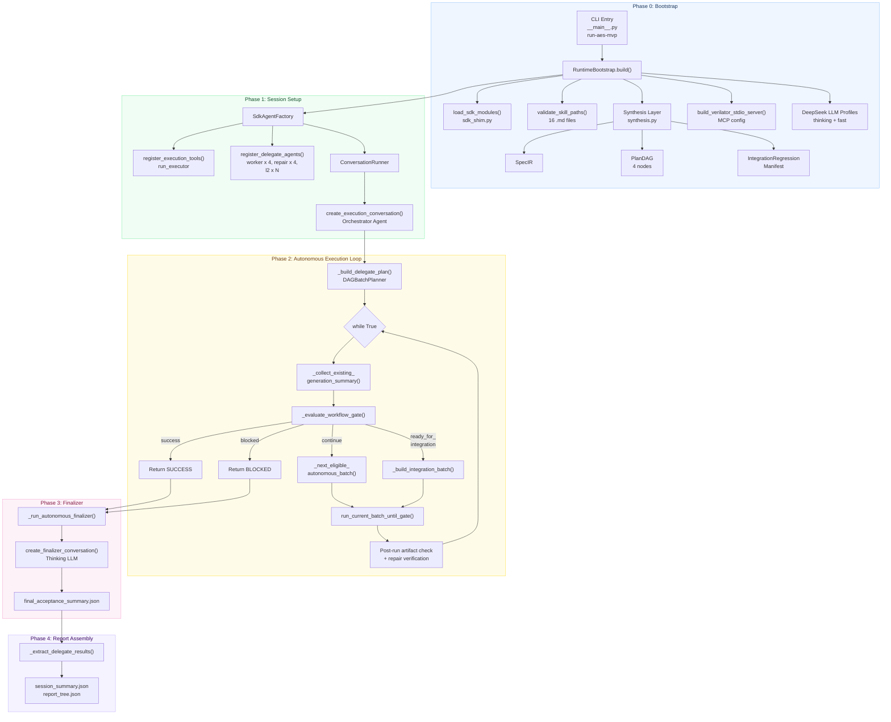

---

## 2. AES Node DAG (Frozen Topology)

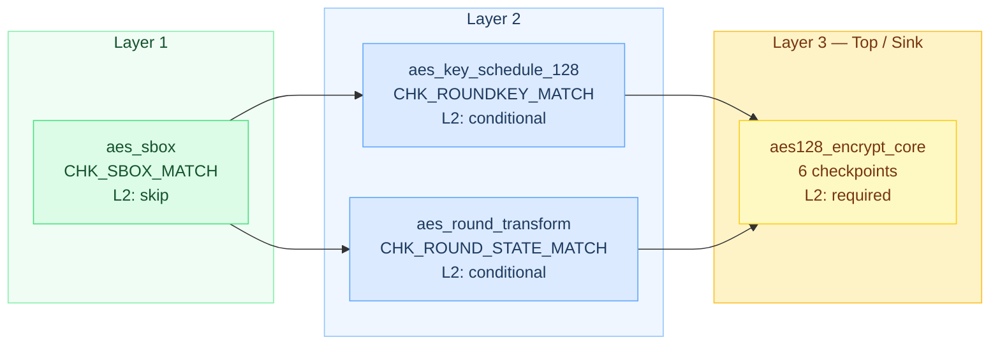

---

## 3. Batch Execution Loop

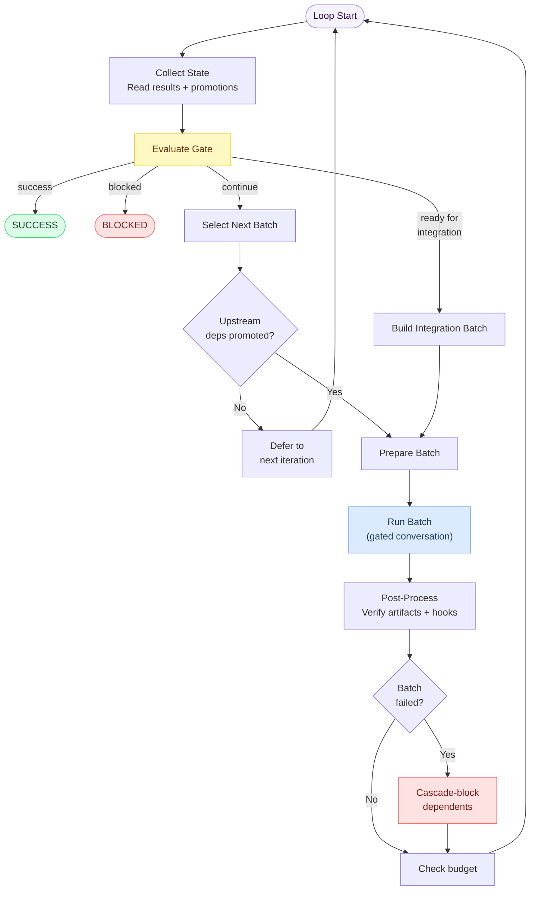

---

## 4. Node Workspace State Machine

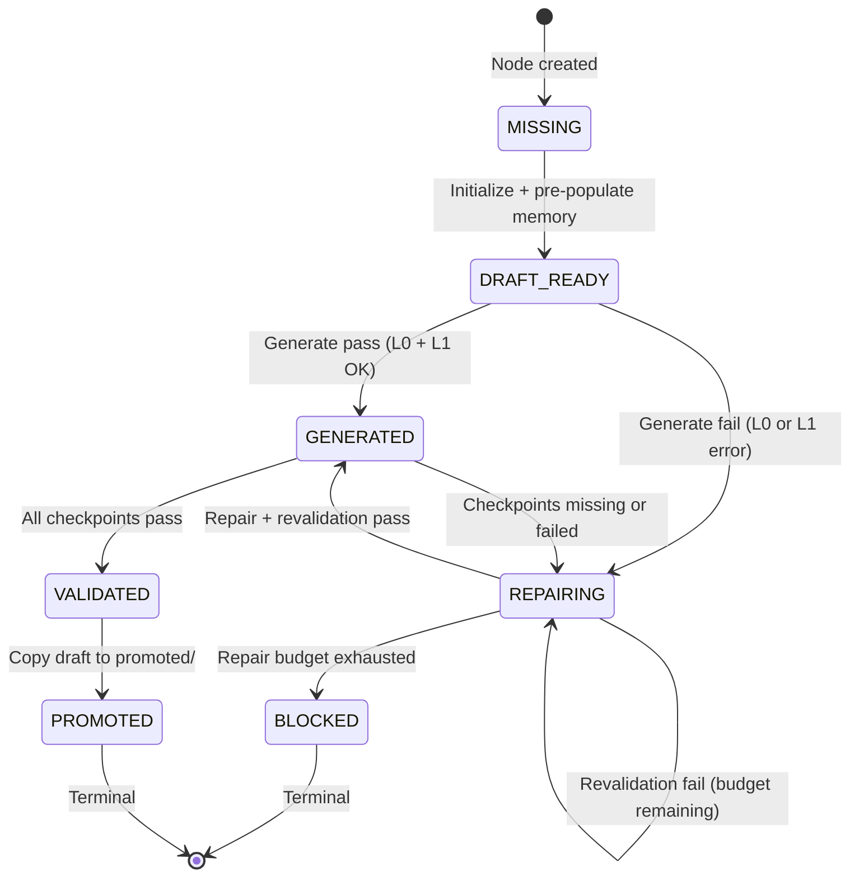

---

## 5. SDK Agent Hierarchy and Delegation

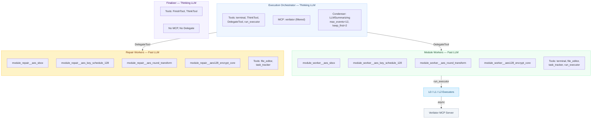

---

## 6. Repair Cycle

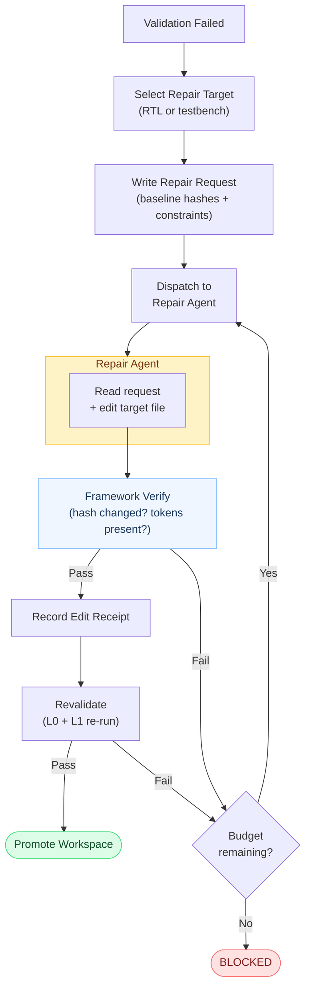

---

## 7. Memory Injection Architecture (3 Paths)

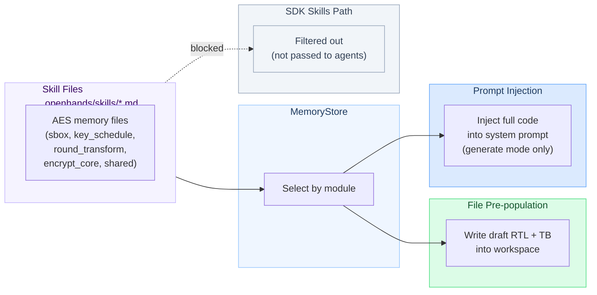

---

## 8. Executor Dispatch Chain

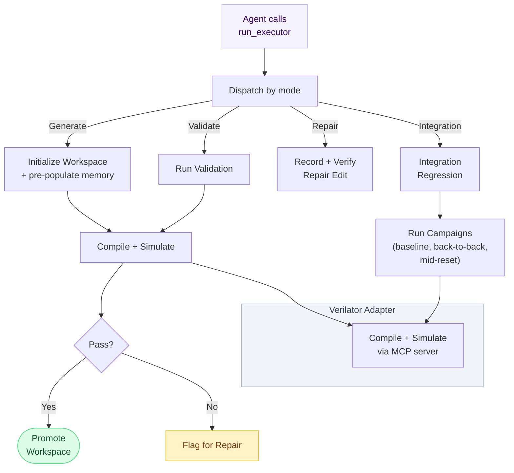

---

## 9. Workflow Gate Decision Logic

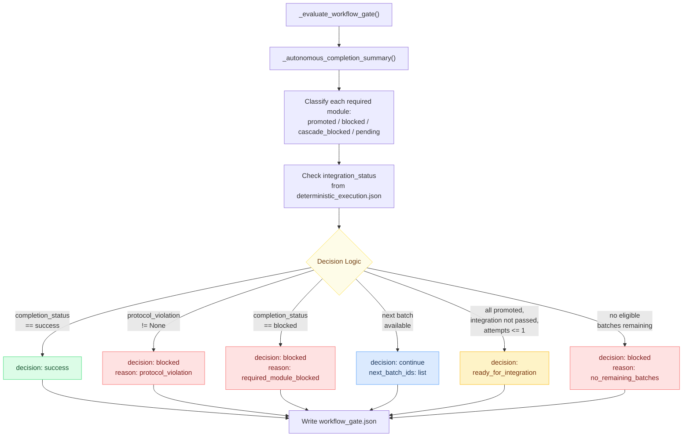

---

## 10. Prompt Composition Architecture

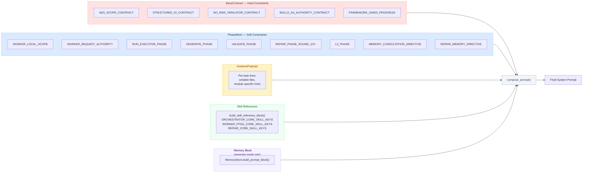

---

## 11. Batch Plan Structure (Typical 4-Module Run)

```mermaid
gantt
    title Batch Execution Order — Topological Layers + Repair Rounds
    dateFormat X
    axisFormat %s

    section Layer 1
    gen_layer_1_1_generate_validate (aes_sbox)        :a1, 0, 1
    gen_layer_1_1_aes_sbox_repair_1                    :a2, 1, 2
    gen_layer_1_1_aes_sbox_revalidate_1                :a3, 2, 3
    gen_layer_1_1_aes_sbox_repair_2                    :a4, 3, 4
    gen_layer_1_1_aes_sbox_revalidate_2                :a5, 4, 5

    section Layer 2
    gen_layer_2_1_generate_validate (ks + rt)           :b1, 5, 6
    gen_layer_2_1_ks_repair_1                           :b2, 6, 7
    gen_layer_2_1_ks_revalidate_1                       :b3, 7, 8
    gen_layer_2_1_rt_repair_1                           :b4, 6, 7
    gen_layer_2_1_rt_revalidate_1                       :b5, 7, 8
    gen_layer_2_1_ks_repair_2                           :b6, 8, 9
    gen_layer_2_1_ks_revalidate_2                       :b7, 9, 10
    gen_layer_2_1_rt_repair_2                           :b8, 8, 9
    gen_layer_2_1_rt_revalidate_2                       :b9, 9, 10

    section Layer 3
    gen_layer_3_1_generate_validate (core)              :c1, 10, 11
    gen_layer_3_1_core_repair_1                         :c2, 11, 12
    gen_layer_3_1_core_revalidate_1                     :c3, 12, 13
    gen_layer_3_1_core_repair_2                         :c4, 13, 14
    gen_layer_3_1_core_revalidate_2                     :c5, 14, 15

    section Integration
    integration                                         :d1, 15, 16
```

---

## 12. JSON Artifact Lifecycle

```mermaid
flowchart TB
    subgraph PlanTime["Plan Time — one-time"]
        SI["spec_ir.json"]
        PD["plan_dag.json"]
        GP["generation_plan.json"]
        BGS["brief_generation_summary.json"]
        BP["batch_plan.json"]
        DP["delegate_plan.json"]
        DR["delegate_requests/\nbatch__worker.json"]
    end

    subgraph PerIteration["Per Loop Iteration"]
        WG["workflow_gate.json\n(re-evaluated each loop)"]
        CBS["current_batch_snapshot.json"]
        BH["batch_history.json\n(appended each batch)"]
        AHD["autonomous_handoff_digest.json"]
        FM["fragility_memory.json\n(updated on L2 results)"]
    end

    subgraph PerNode["Per Node Workspace"]
        WS["workspace_state.json"]
        MC["contracts/module_contract.json"]
        TC["contracts/testbench_contract.json"]
        DB["contracts/design_brief.json"]
        GR["generation_result.json"]
        RR["repair_request.json"]
        ER["edit_receipt.json"]
        VS["validation/validation_summary.json"]
        L0R["validation/l0_result.json"]
        MRR["validation/sim/module_run_result.json"]
        PR["promotion/promotion_record.json"]
    end

    subgraph SessionEnd["Session End"]
        PE["promotion_events.json"]
        PF["promotion_failures.json"]
        IS["integration_summary.json"]
        DE["deterministic_execution.json"]
        DRes["delegate_results.json"]
        DFB["delegate_fallbacks.json"]
        FI["finalizer_input.json"]
        FAS["final_acceptance_summary.json"]
        SS["session_summary.json"]
        RT["report_tree.json"]
    end

    PlanTime --> PerIteration
    PerIteration --> PerNode
    PerNode --> SessionEnd

    style PlanTime fill:#eff6ff,stroke:#93c5fd,color:#1e3a5f
    style PerIteration fill:#fefce8,stroke:#fde047,color:#713f12
    style PerNode fill:#f5f3ff,stroke:#c4b5fd,color:#3b0764
    style SessionEnd fill:#f0fdf4,stroke:#86efac,color:#14532d
```

---

## 13. Error Recovery Flow (Provider Failure)

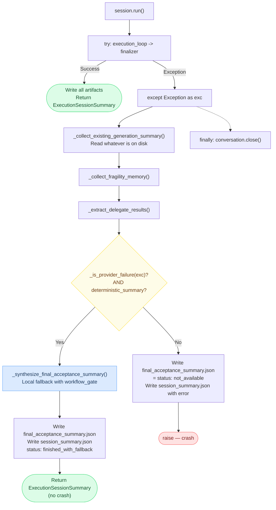

---

## 14. Orchestrator State Machine Transitions

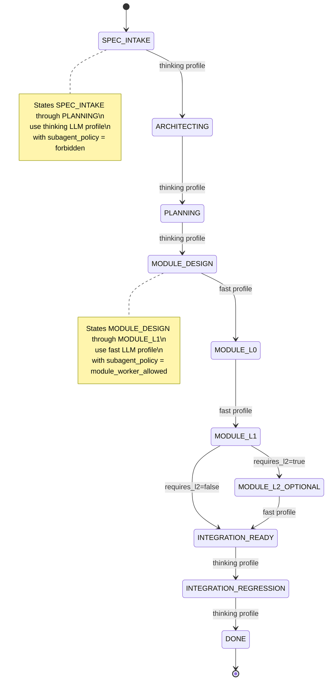
