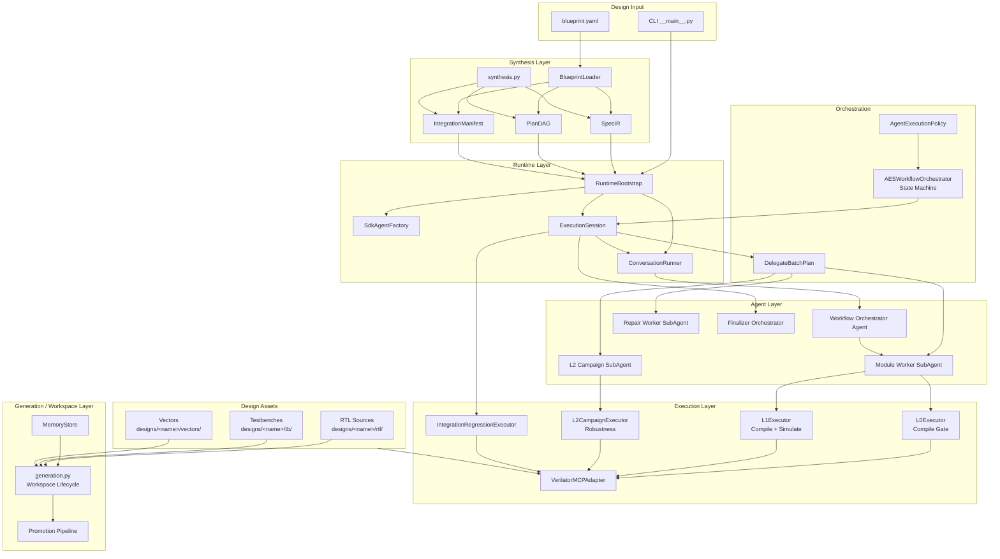
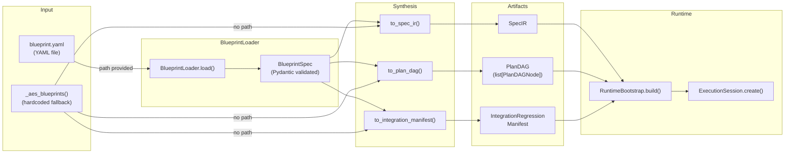
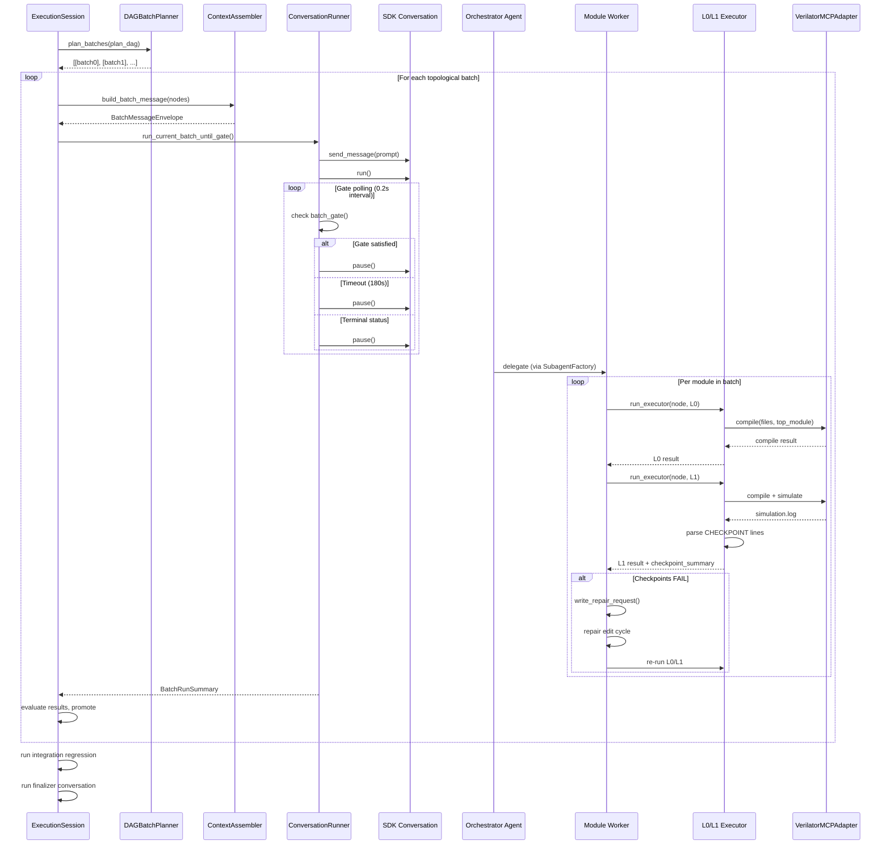
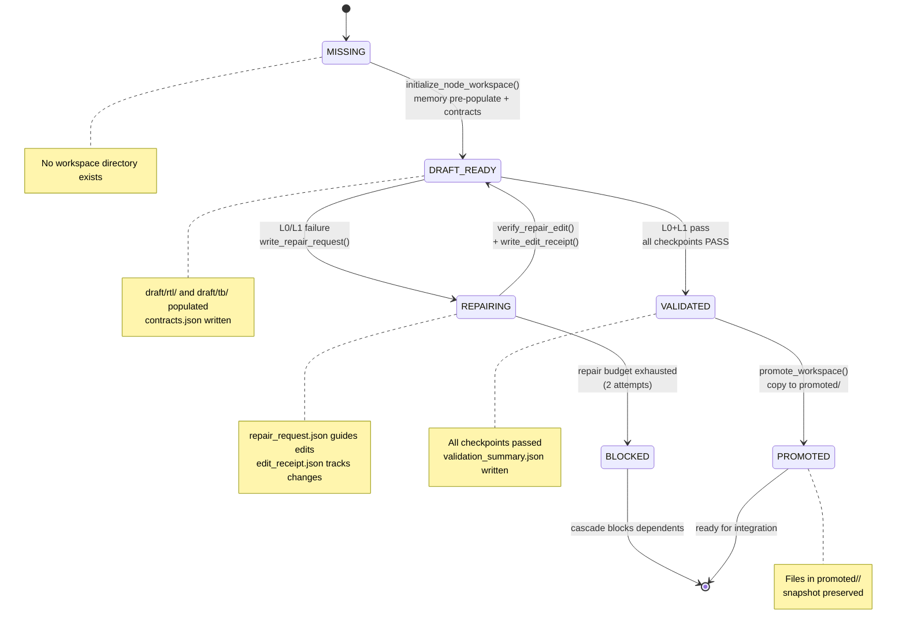
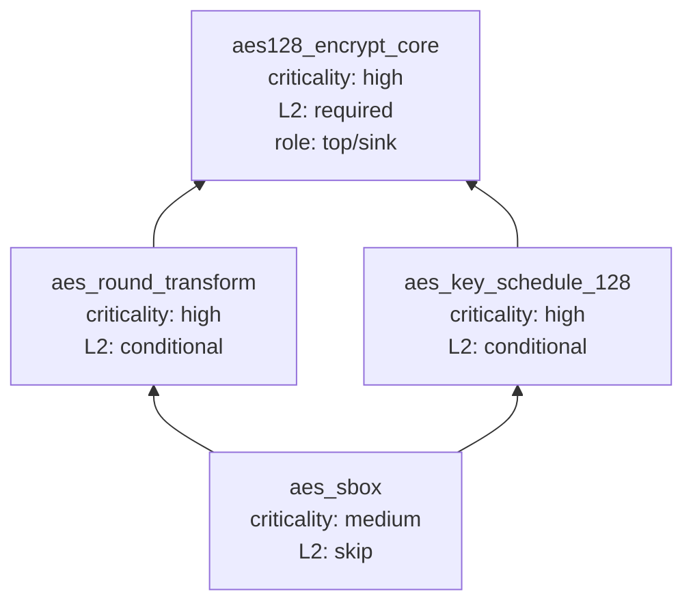

# Multi-Agent FPGA System: Architecture & API Reference

## 1. High-Level System Architecture



## 2. Orchestrator State Machine

```mermaid
stateDiagram-v2
    [*] --> SPEC_INTAKE

    SPEC_INTAKE --> ARCHITECTING : success
    ARCHITECTING --> PLANNING : success
    PLANNING --> MODULE_DESIGN : success

    state "Module Pipeline (per batch)" as ModPipeline {
        MODULE_DESIGN --> MODULE_L0 : success
        MODULE_L0 --> MODULE_L1 : success
        MODULE_L1 --> MODULE_L2_OPTIONAL : requires_l2=true
        MODULE_L1 --> INTEGRATION_READY : requires_l2=false
        MODULE_L2_OPTIONAL --> INTEGRATION_READY : success
    }

    INTEGRATION_READY --> INTEGRATION_REGRESSION : success
    INTEGRATION_REGRESSION --> DONE : success
    DONE --> [*]

    note right of SPEC_INTAKE : LLM: thinking | Subagent: forbidden
    note right of ARCHITECTING : LLM: thinking | Subagent: forbidden
    note right of PLANNING : LLM: thinking | Subagent: forbidden
    note right of MODULE_DESIGN : LLM: fast | Subagent: module_worker_allowed
    note right of MODULE_L0 : LLM: fast | Subagent: module_worker_allowed
    note right of MODULE_L1 : LLM: fast | Subagent: module_worker_allowed
    note right of MODULE_L2_OPTIONAL : LLM: fast | Subagent: l2_campaign_allowed
    note right of INTEGRATION_READY : LLM: thinking | Subagent: forbidden
    note right of INTEGRATION_REGRESSION : LLM: thinking | Subagent: forbidden
```

### State-to-Policy Mapping

| State | LLM Profile | Subagent Policy | Purpose |
|-------|-------------|-----------------|---------|
| `SPEC_INTAKE` | `deepseek_official_thinking` | `forbidden` | Parse design specification |
| `ARCHITECTING` | `deepseek_official_thinking` | `forbidden` | Architectural decisions |
| `PLANNING` | `deepseek_official_thinking` | `forbidden` | Generate module DAG plan |
| `MODULE_DESIGN` | `deepseek_official_fast` | `module_worker_allowed` | Design individual modules |
| `MODULE_L0` | `deepseek_official_fast` | `module_worker_allowed` | Compile gate (Verilator) |
| `MODULE_L1` | `deepseek_official_fast` | `module_worker_allowed` | Simulate + checkpoint validation |
| `MODULE_L2_OPTIONAL` | `deepseek_official_fast` | `l2_campaign_allowed` | Robustness testing (optional) |
| `INTEGRATION_READY` | `deepseek_official_thinking` | `forbidden` | Pre-integration readiness check |
| `INTEGRATION_REGRESSION` | `deepseek_official_thinking` | `forbidden` | Full integration regression |

### Escalation Rule

If a module worker fails after **2 repair attempts**, or the failure is **cross-module / interface / state-machine** in nature, control returns to the thinking orchestrator.

## 3. Blueprint-Driven Pipeline



### Blueprint YAML Schema

```yaml
design:
  name: <string>            # Required: design name
  scope: <string>           # Required: design scope description
  autonomous_goal: <string> # System goal for autonomous execution
  algorithm: <string>       # Algorithm name (e.g., "AES")
  variant: <string>         # Variant (e.g., "AES-128")
  # ... additional SpecIR-level fields

modules:
  - id: <string>            # Module identifier
    rtl: <string|list>      # RTL file path(s), relative to blueprint parent
    tb: <string>            # Testbench file path
    checkpoints: [...]      # Expected CHECKPOINT names
    depends_on: [...]       # Dependency module IDs
    integration_role: leaf|top|sink
    vectors: <string>       # Vector file path
    l2_profiles: [...]      # L2 campaign profile names
    repair_hints:           # Optional repair guidance
      must_add_tokens: [...]
      guidance: <string>
    ports: [...]            # Port specifications
    design_goals: [...]     # Design goals for prompt enrichment

integration:                # Optional integration regression config
  top_module: <string>
  vector_set: <string>
  regression_checkpoints: [...]
```

## 4. Batch Execution Flow



## 5. Module Workspace Lifecycle



### Workspace Directory Layout

```
<workspace_root>/<module_id>/
  contracts.json              # ModuleContract + TestbenchContract + ModuleDesignBrief
  workspace_state.json        # NodeWorkspaceRecord (state tracking)
  draft/
    rtl/<module>.v            # Draft RTL (from memory pre-population)
    tb/<module>_tb.cpp        # Draft testbench (from memory pre-population)
  reports/
    generation_result.json    # Generation/validation result
    validation_summary.json   # Checkpoint rollup
    repair_request.json       # Repair guidance (if needed)
    edit_receipt.json          # Edit verification receipt
  promoted/
    <module_id>/              # Promoted (validated) files
  snapshots/                  # Historical snapshots
```

## 6. AES-128 Node DAG (Reference Design)



### Topological Batch Order

| Batch | Modules | Parallel |
|-------|---------|----------|
| 0 | `aes_sbox` | 1 module |
| 1 | `aes_key_schedule_128`, `aes_round_transform` | 2 modules |
| 2 | `aes128_encrypt_core` | 1 module (integration sink) |

## 7. API Reference

### 7.1 Contract Layer

#### `artifacts.py` -- Pydantic Data Models

| Class | Description |
|-------|-------------|
| `SpecIR` | Design specification intermediate representation (algorithm, variant, interfaces, redlines) |
| `PlanDAG` | Directed acyclic graph of module nodes with dependency validation and cycle detection |
| `PlanDAGNode` | Single module: RTL files, TB, checkpoints, L2 policy, design_context |
| `L1PassCriteria` | L1 gate criteria: sim pass, assertion pass, coverage checkpoints, vector set |
| `PassCriteria` | Wrapper containing `L1PassCriteria` |
| `ModuleRunResult` | Compile/simulate outcome with checkpoint summary |
| `ModuleContract` | Per-module contract: ports, dependencies, checkpoints, writable targets |
| `TestbenchContract` | TB contract: language, vector format, checkpoint names, plusargs |
| `ModuleDesignBrief` | Design brief: goals, hints, skill paths, workspace strategy |
| `NodeWorkspaceState` | Enum: `MISSING`, `DRAFT_READY`, `VALIDATED`, `PROMOTED`, `REPAIRING`, `BLOCKED`, `FAILED` |
| `ValidationFailurePhase` | Enum: `L0_COMPILE`, `L1_SIM`, `CHECKPOINT_MISSING`, `CHECKPOINT_FAILED` |
| `NodeWorkspaceRecord` | Workspace state tracker: paths, validation count, repair count |
| `RepairContract` | Repair guidance: target file, edit steps, must_add_tokens, error excerpt |
| `EditReceipt` | Post-repair receipt: edited files, first edit summary |
| `PromotionRecord` | Promotion event: draft paths, promoted targets, checkpoint summary |
| `IntegrationRegressionManifest` | Integration config: top module, RTL closure, regression checkpoints |
| `PortSpec` | Port specification: name, direction, width, description |

#### `policy.py` -- Execution Policy

| Class/Enum | Description |
|------------|-------------|
| `OrchestratorState` | 10-state enum for the workflow state machine |
| `LLMProfileName` | Enum: `DEEPSEEK_OFFICIAL_THINKING`, `DEEPSEEK_OFFICIAL_FAST` |
| `SubagentPolicy` | Enum: `FORBIDDEN`, `MODULE_WORKER_ALLOWED`, `L2_CAMPAIGN_ALLOWED` |
| `AgentRole` | Enum: `WORKFLOW_ORCHESTRATOR`, `MODULE_WORKER_SUBAGENT`, `L2_CAMPAIGN_SUBAGENT` |
| `AgentExecutionPolicy` | Maps every `OrchestratorState` to LLM profile + subagent policy; validates completeness |

Key methods:
- `profile_for_state(state)` -> `LLMProfileName`
- `subagent_policy_for_state(state)` -> `SubagentPolicy`
- `should_escalate(repair_attempts, *, cross_module_issue, state_machine_issue, interface_issue)` -> `bool`

#### `executor_contracts.py` -- Resolved Inputs

| Class/Function | Description |
|----------------|-------------|
| `ExecutorKind` | Enum: `L0_COMPILE`, `L1_SIM`, `L2_CAMPAIGN`, `INTEGRATION_REGRESSION` |
| `ResolvedNodeCompileInputs` | Resolved compile inputs with absolute paths |
| `ResolvedL2CampaignInputs` | Resolved L2 campaign inputs with profile, vecfile, seed, cases |
| `ResolvedIntegrationRegressionInputs` | Resolved integration regression inputs |
| `resolve_node_compile_inputs(node, package_root)` | Resolve relative paths to absolute |
| `resolve_l2_campaign_inputs(node, ...)` | Resolve L2 campaign paths |
| `resolve_integration_regression_inputs(manifest, package_root)` | Resolve integration paths |
| `resolve_path(base, relative)` | Path resolution: absolute paths bypass base |
| `summarize_required_checkpoints(node)` | Extract checkpoint names from pass_criteria |

#### `paths.py` -- Path Constants

| Constant | Value |
|----------|-------|
| `PACKAGE_ROOT` | `fpga_flow/` directory |
| `PROJECT_ROOT` | `MultiAgent_FPGA/` directory |
| `REPO_ROOT` | Repository root |
| `DESIGNS_DIR` | `MultiAgent_FPGA/designs/` |
| `REPORTS_DIR` | `fpga_flow/reports/` |

### 7.2 Synthesis Layer

#### `synthesis.py` -- Artifact Synthesis

| Function | Description |
|----------|-------------|
| `synthesize_spec_ir(*, system_goal, blueprint_path=None)` | Build SpecIR from blueprint YAML or hardcoded AES fallback |
| `synthesize_plan_dag(spec_ir, *, blueprint_path=None, design_root=None)` | Build PlanDAG; resolves relative paths against `design_root` |
| `synthesize_integration_manifest(spec_ir, plan_dag)` | Build IntegrationRegressionManifest from plan DAG sink |
| `synthesize_agent_execution_policy()` | Build the state-to-policy mapping |
| `validate_plan_dag_l1_vector_paths(plan_dag)` | Check all L1 vector files exist on disk |

| Class | Description |
|-------|-------------|
| `DAGBatchPlanner` | Produces topological-layer batches from PlanDAG |
| `L2AdaptivePlanner` | Selects L2 profiles from fragility history |
| `FragilityMemory` / `FragilitySignal` | Track fragility signals for adaptive L2 planning |
| `IntegrationReadinessResolver` | Computes dependency closures and selects the integration sink |
| `ContractCompiler` | Generates per-node `ModuleContract`, `TestbenchContract`, `ModuleDesignBrief` |
| `NodePolicyEngine` | Decides workspace state transitions (generate/repair/blocked) |

#### `blueprint_loader.py` -- Blueprint Loading

| Class | Description |
|-------|-------------|
| `BlueprintSpec` | Root Pydantic model for YAML blueprint (design + modules + vectors + integration) |
| `DesignMeta` | Top-level design metadata (name, scope, algorithm, variant, timing, etc.) |
| `ModuleSpec` | Per-module specification (id, rtl, tb, checkpoints, ports, repair_hints, etc.) |
| `RepairHintsSpec` | Optional repair guidance (must_add_tokens, guidance text) |
| `MemorySpec` | Optional memory skill references (rtl_skill, tb_skill, shared_skill) |
| `VectorsSpec` | Vector base directory configuration |
| `IntegrationSpec` | Integration regression configuration |
| `BlueprintLoader` | Static loader class |

Key methods:
- `BlueprintLoader.load(path)` -> `BlueprintSpec` -- Parse and validate YAML
- `BlueprintLoader.to_spec_ir(blueprint, *, system_goal=None)` -> `SpecIR`
- `BlueprintLoader.to_plan_dag(blueprint, spec_ir, *, design_root=None)` -> `PlanDAG`
- `BlueprintLoader.to_integration_manifest(blueprint, spec_ir, plan_dag)` -> `IntegrationRegressionManifest | None`

### 7.3 Execution Layer

#### `executors.py` -- Verilator Executors

| Class | Description |
|-------|-------------|
| `CheckpointParser` | Parses `CHECKPOINT\|<name>\|PASS\|<detail>` lines from simulation.log |
| `RunReportWriter` | Writes structured JSON reports for executor runs |
| `_BaseExecutor` | Abstract base: owns CheckpointParser + RunReportWriter |
| `L0Executor` | Compile gate -- Verilator compile only, returns pass/fail |
| `L1Executor` | Compile + simulate + checkpoint parsing, passes +fpga_flow_package_root and +vecfile plusargs, returns `ModuleRunResult` |
| `L2CampaignExecutor` | Robustness campaigns with plusargs (+profile/+vecfile/+seed/+cases), writes counterexample.json and fragility_summary.json |
| `IntegrationRegressionExecutor` | Baseline + back_to_back + mid_reset campaigns, passes +fpga_flow_package_root and +vecfile plusargs |

| Protocol | Description |
|----------|-------------|
| `SupportsVerilatorAdapter` | Protocol for compile/simulate async methods |

#### `adapters/verilator.py` -- Verilator MCP Adapter

| Class/Function | Description |
|----------------|-------------|
| `VerilatorMCPAdapter` | Wraps OpenHands MCP (`verilator_compile`, `verilator_simulate`) |
| `build_verilator_stdio_server()` | Builds `MCPStdioServerConfig` for Node.js verilator-mcp server |

Key behaviors:
- Filters input files and auto-generates `-I` include flags
- Adds `-CFLAGS -std=c++17` for C++ testbenches
- Uses `MCPStdioServerConfig` pointing to `mcp4eda/verilator-mcp/dist/index.js`

### 7.4 Runtime Layer

#### `runtime/bootstrap.py` -- RuntimeBootstrap

| Class | Description |
|-------|-------------|
| `RuntimeBootstrap` | Frozen dataclass: SDK modules, paths, skills, LLM profiles, policy, artifacts, MCP config |

Key method:
- `RuntimeBootstrap.build(*, workspace_root, repo_root, persistence_dir, allow_placeholder_api_key, system_goal, blueprint_path)` -> `RuntimeBootstrap`
  1. Loads SDK modules via `load_sdk_modules()`
  2. Validates 13+ skill files
  3. Builds LLM profile kwargs (thinking + fast)
  4. Synthesizes SpecIR / PlanDAG / IntegrationManifest
  5. Configures Verilator MCP server
- `create_verilator_adapter(*, conversation_id)` -> `VerilatorMCPAdapter`
- `to_summary()` -> `dict` (dry-run output)
- `orchestrator()` -> `AESWorkflowOrchestrator`

#### `runtime/factory.py` -- SdkAgentFactory

| Class | Description |
|-------|-------------|
| `RuntimeAgentHandle` | Frozen dataclass: role, LLM profile, spawn spec, SDK agent |
| `SdkAgentFactory` | Creates agents per role with LLM condenser and MCP tool filtering |

Key methods:
- `create_execution_orchestrator()` -- Main orchestrator agent (with LLM condenser)
- `create_finalizer_orchestrator()` -- Terminal summary agent
- `create_module_worker(node)` -- Per-module worker agent
- `create_repair_worker()` -- Repair-focused agent
- `create_l2_campaign_agent(node, profile, vecfile, ...)` -- L2 robustness agent
- `register_subagent_factories()` -- Registers delegate factories for SDK subagent spawning

#### `runtime/runner.py` -- ConversationRunner

| Class | Description |
|-------|-------------|
| `ConversationSummary` | Frozen dataclass: conversation_id, status, event count, paths |
| `BatchRunSummary` | Frozen dataclass: conversation summary + gate_satisfied + pause_reason + timed_out |
| `ConversationRunner` | Creates and drives SDK conversations |

Key methods:
- `create_execution_conversation(*, conversation_id, persistence_dir, ...)` -- Creates main conversation
- `create_finalizer_conversation(...)` -- Creates finalizer conversation
- `send_and_run(conversation, message)` -> `ConversationSummary`
- `run_current_batch_until_gate(conversation, message, *, batch_gate, timeout_s=180)` -> `BatchRunSummary`
  - Polls `batch_gate()` callback at `poll_interval_s` (0.2s)
  - Pauses when gate satisfied, timeout reached, or terminal status detected
  - Runs conversation in a daemon thread to allow gate polling
  - All `pause()` calls use `_safe_pause()` — daemon-thread wrapper with 10s timeout to prevent SDK deadlock when runner thread is stuck in `os.waitpid()`

#### `runtime/session.py` -- ExecutionSession

| Class | Description |
|-------|-------------|
| `ExecutionSessionSummary` | Full session outcome dataclass |
| `ExecutionSession` | Top-level orchestration driver |

Key methods:
- `ExecutionSession.create(bootstrap)` -- Factory constructor
- `run(message)` -> `ExecutionSessionSummary`
  1. Plans batches via `DAGBatchPlanner`
  2. For each batch: initializes workspaces, runs gate-controlled conversation
  3. Evaluates results, manages repair cycles
  4. Handles promotion to `promoted/` directory
  5. Runs integration regression
  6. Produces finalizer conversation for terminal summary

#### `runtime/sdk_shim.py` -- SDK Import Shim

| Class/Function | Description |
|----------------|-------------|
| `SDKUnavailableError` | Raised when OpenHands SDK is not installed |
| `SdkModules` | Dataclass holding imported SDK module references |
| `load_sdk_modules()` -> `SdkModules` | Imports SDK with compatibility patching for `rich` and `google.protobuf` |

Environment variable: `OPENHANDS_SDK_SITE_PACKAGES` -- load SDK from a non-default location.

#### `runtime/context_assembler.py` -- Prompt Context Assembly

| Class | Description |
|-------|-------------|
| `BatchMessageEnvelope` | Structured batch message for conversation prompts |
| `TaskContractEnvelope` | Per-task contract envelope with module contracts |
| `ContextAssembler` | Builds structured prompts combining contracts + phase mixins + skill refs |

#### `runtime/execution_tools.py` -- Custom Agent Tools

| Function | Description |
|----------|-------------|
| `register_execution_tools()` | Registers the `run_executor` custom tool that agents call instead of raw Verilator MCP |

### 7.5 Generation / Workspace Layer

#### `generation.py` -- Workspace Lifecycle

| Function | Description |
|----------|-------------|
| `initialize_node_workspace(node, workspace_root)` | Creates workspace dirs, writes contracts JSON, pre-populates draft RTL+TB from memory |
| `write_repair_request(node, workspace_root, ...)` | Writes repair_request.json with targeted guidance |
| `verify_repair_edit(node, workspace_root, ...)` | Verifies file hash changes and required token presence |
| `write_edit_receipt(node, workspace_root, ...)` | Writes edit_receipt.json after verified repair |
| `promote_workspace(node, workspace_root)` | Copies validated drafts to `promoted/<module_id>/` |
| `write_generation_result(...)` | Writes generation_result.json |
| `evaluate_validation_result(...)` | Computes pass/fail from checkpoint rollup |
| `conversation_workspace_root(conversation_id, bootstrap)` | Returns workspace path for a conversation |
| `conversation_promoted_root(conversation_id, bootstrap)` | Returns promoted path for a conversation |
| `repair_budget_for_node(node)` | Returns max repair attempts (default: 2) |
| `load_repair_contract(...)` | Loads RepairContract from JSON |
| `write_budget_exhausted_result(...)` | Records budget exhaustion |
| `write_cascade_block_result(...)` | Records cascade block from failed dependency |
| `write_defensive_failure_result(...)` | Records defensive failure |

#### `memory.py` -- Memory Pre-Population

| Class | Description |
|-------|-------------|
| `MemoryRegistry` | Maps module_id to memory skill keys; `default()` for AES, `from_blueprint()` for YAML |
| `MemoryStore` | Single source of truth for reference memory retrieval |

Key methods:
- `MemoryStore.has_module_memory(module_id)` -> `bool` -- Check if module-specific memory is registered
- `MemoryStore.select(module_id)` -> list of `MemoryArtifact`
- `MemoryStore.retrieve(key)` -> single skill content
- `MemoryStore.build_prompt_block(module_id)` -> prompt-injectable text
- `MemoryStore.populate_workspace(module_id, workspace_root)` -> dict of written files (empty dict when `memory_required=False` and no memory registered)

### 7.6 Agent / Prompt Layer

#### `agents/specs.py` -- Agent Spawn Specifications

| Class | Description |
|-------|-------------|
| `AgentSpawnSpec` | Frozen dataclass: role, LLM profile, system prompt, skill keys, allowed states, writable paths, custom tools |

| Factory Function | Description |
|-----------------|-------------|
| `build_workflow_orchestrator_spec()` | Main orchestrator: all states, run_executor tool |
| `build_module_worker_spec(node)` | Per-module worker: MODULE_DESIGN/L0/L1 states |
| `build_repair_worker_spec(*, design_name)` | Repair worker: L0/L1 states, design-parameterized memory directive |
| `build_l2_campaign_spec(node, profile, vecfile, ...)` | L2 campaign: MODULE_L2_OPTIONAL state |
| `build_finalizer_orchestrator_spec()` | Finalizer: DONE state |

#### `prompts.py` -- Prompt Composition

| Function | Description |
|----------|-------------|
| `build_execution_orchestrator_prompt()` | Orchestrator system prompt |
| `build_finalizer_orchestrator_prompt()` | Finalizer system prompt |
| `build_module_worker_prompt(node)` | Module worker prompt; derives scope from `node.design_context['scope']` and memory directive from `design_context['algorithm']` |
| `build_repair_worker_prompt(*, design_name)` | Repair worker prompt; parameterized memory directive |
| `build_l2_campaign_prompt(node, profile, vecfile, ...)` | L2 campaign prompt; derives scope from node |
| `_scope_from_node(node)` | Helper: builds `BaseContract` from `design_context['scope']` |
| `_design_name_from_node(node)` | Helper: extracts algorithm name for memory directive |

#### `prompt_contracts.py` -- Reusable Prompt Blocks

| Constant | Description |
|----------|-------------|
| `AES_SCOPE_CONTRACT` | Scope contract for AES-128 encrypt-only (backward-compatible default) |
| `build_scope_contract(scope_text)` | Factory: build a design-specific scope contract from blueprint `design.scope` |
| `build_memory_directive(design_name)` | Factory: build memory consultation directive parameterized by design name |
| `build_repair_memory_directive(design_name)` | Factory: build repair memory directive parameterized by design name |
| `NO_RAW_VERILATOR_CONTRACT` | Prohibition on direct Verilator MCP calls |
| `FRAMEWORK_OWNS_PROGRESS_CONTRACT` | Framework controls batch progression |
| `REPAIR_PHASE_ROUND_1` | First repair: edit-first protocol |
| `REPAIR_PHASE_ROUND_2_PLUS` | Subsequent repairs: iterative protocol |
| `WORKER_LOCAL_SCOPE` | Worker local scope constraint |

#### `skill_refs.py` -- Skill File References

| Class/Function | Description |
|----------------|-------------|
| `SkillRef` | Dataclass: name, key, path, category |
| `SkillRegistry` | Dynamic skill loading from design directory |
| `get_runtime_skill_refs()` | 5 agent-injected skill refs |
| `get_memory_skill_refs()` | 5 memory-owned skill refs |
| `get_documentation_skill_refs()` | 6 doc-only skill refs |
| `get_all_skill_refs()` | Union of all 16 skill refs |
| `validate_skill_paths()` | Verify AES skill files exist on disk |
| `select_worker_skill_keys(mode, design_name=)` | Design-aware skill key selection: AES keys for AES, empty for others |
| `orchestrator_skill_keys(design_name)` | Design-aware orchestrator skill key selection |
| `_is_aes_design(design_name)` | Routing predicate: True for AES/None, False otherwise |
| `build_skill_reference_block(*keys)` | Build constraint block; returns empty string for empty keys |

Design-aware skill routing:
- AES designs: `_AES_ORCHESTRATOR_SKILL_KEYS`, `_AES_WORKER_FPGA_CORE_SKILL_KEYS`, `_AES_REPAIR_SKILL_KEYS`
- Non-AES designs: empty tuples (`_GENERIC_*_SKILL_KEYS`) — no AES context pollution
- `SDK_DELEGATION_SKILL_KEYS` -- SDK delegation (always injected)
- `FINALIZER_SKILL_KEYS` -- Finalizer skills (always empty)

### 7.7 Orchestrator

#### `orchestrator/state_machine.py` -- AESWorkflowOrchestrator

| Class | Description |
|-------|-------------|
| `ModuleWorkOrder` | Frozen dataclass: node + state + repair_attempts |
| `L2CampaignRequest` | Frozen dataclass: node + profile + vecfile + cases + seed |
| `StateTraceEntry` | Frozen dataclass: state trace for debugging |
| `AESWorkflowOrchestrator` | Decision logic for state machine and task routing |

Key methods:
- `from_defaults()` -- Factory using hardcoded AES defaults
- `get_node(module_id)` -> `PlanDAGNode`
- `next_state_after_success(state, *, requires_l2)` -> `OrchestratorState`
- `build_module_work_order(module_id, state)` -> `ModuleWorkOrder`
- `build_l2_campaign_request(module_id, *, profile, vecfile, ...)` -> `L2CampaignRequest`
- `describe_state_progression(*, focus_module_id)` -> `list[StateTraceEntry]`
- `should_escalate(repair_attempts, *, cross_module_issue, ...)` -> `bool`

### 7.8 Delegation

#### `delegation.py` -- Batch Delegation

| Class/Enum | Description |
|------------|-------------|
| `SubagentWorkMode` | Enum: `GENERATE`, `VALIDATE`, `REPAIR`, `L2_EXECUTE`, `INTEGRATION` |
| `NodeExecutionRequest` | Per-node task: executor_kind, workspace paths, manual commands |
| `DelegateBatchTask` | Worker assignment: worker_id, agent_type, mode, request, prompt |
| `DelegateBatchPlan` | Batch plan: batch_id, stage, max_children (default: 5), tasks |

Key methods:
- `DelegateBatchPlan.spawn_payload()` -- Generate spawn command for workers
- `DelegateBatchPlan.delegate_payload()` -- Generate delegate command with prompts

## 8. OpenHands SDK v1 Key APIs

The Multi-Agent FPGA System is built on the **OpenHands SDK v1** (`openhands-sdk` package). The SDK provides the foundational primitives for agent creation, conversation management, and tool integration.

### 8.1 Agent Creation

```python
from openhands.sdk.agent import Agent

agent = Agent(
    name="workflow_orchestrator",
    llm=llm_instance,                  # LLM configuration
    system_prompt="...",               # Role-specific prompt
    skills=runtime_skills,             # Loaded skill objects
    tools=[run_executor_tool],         # Custom tools
    mcp_config=mcp_config,            # MCP server configuration
    condenser=condenser_config,        # History condensation (optional)
    subagent_factory=factory,          # For delegate spawning
    allowed_mcp_tools=tool_filter,     # Regex filter for MCP tools
)
```

### 8.2 Conversation Management

```python
from openhands.sdk.conversation import Conversation
from openhands.sdk.workspace import LocalWorkspace

conversation = Conversation(
    agent,
    workspace=LocalWorkspace(working_dir=workspace_path),
    persistence_dir=persistence_dir,
    conversation_id=uuid,
    delete_on_close=True,
    max_iteration_per_run=100,
)

conversation.send_message("Execute the design pipeline...")
conversation.run()
conversation.pause()

# Access state
state = conversation.state
status = state.execution_status  # ConversationExecutionStatus enum
events = state.events
```

### 8.3 LLM Configuration

```python
from openhands.sdk.llm import LLM

llm = LLM(
    model="deepseek-chat",
    api_key=os.environ["DEEPSEEK_API_KEY"],
    base_url="https://api.deepseek.com",
    custom_llm_provider="openai",       # OpenAI-compatible API
    temperature=0.0,                     # For deterministic output
    # ... additional kwargs
)
```

Two profiles used:
- **thinking** (`deepseek_official_thinking`): For planning/architecture states
- **fast** (`deepseek_official_fast`): For module design/execution states

### 8.4 MCP Server Integration

```python
from openhands.sdk.mcp import MCPStdioServerConfig

mcp_server = MCPStdioServerConfig(
    name="verilator",
    command="node",
    args=["mcp4eda/verilator-mcp/dist/index.js"],
    env={"PATH": os.environ["PATH"]},
)

mcp_config = {
    "mcpServers": {
        mcp_server.name: {
            "command": mcp_server.command,
            "args": list(mcp_server.args),
            "env": dict(mcp_server.env),
        }
    }
}
```

Available MCP tools (filtered):
- `verilator_compile` -- Compile Verilog with Verilator
- `verilator_simulate` -- Run simulation
- `verilator_testbenchgenerator` -- **BLOCKED** (filtered out)
- `verilator_naturallanguage` -- **BLOCKED** (filtered out)

### 8.5 Skill Loading

```python
# Load all skills from .openhands/skills/ directory
loaded_skills = sdk.load_project_skills(str(repo_root))

# Filter to runtime-required skills
runtime_skills = [loaded_by_name[ref.name] for ref in skill_refs.values()]
```

Skills are markdown files in `.openhands/skills/` containing domain knowledge (AES reference implementations, repair heuristics, testbench contracts, etc.).

### 8.6 Subagent Delegation

```python
from openhands.tools.delegate import DelegateTool

# Register subagent factories
agent.register_subagent_factory(
    name="module_worker",
    factory=lambda: create_module_worker(node),
)

# Agents use delegation within conversations to spawn workers
```

### 8.7 Custom Tool Registration

```python
from openhands.sdk.tool import Tool

run_executor_tool = Tool(
    name="run_executor",
    description="Execute L0/L1/L2/Integration verification",
    parameters={...},
    handler=run_executor_handler,
)
```

The `run_executor` tool is the **only** allowed way for agents to trigger compile/simulate -- agents never call raw Verilator MCP tools directly.

## 9. CLI Commands Reference

```bash
# Contract validation (no SDK or API key needed)
PYTHONPATH=. python -m MultiAgent_FPGA.fpga_flow validate
PYTHONPATH=. python -m MultiAgent_FPGA.fpga_flow validate --blueprint designs/aes128/blueprint.yaml

# SDK smoke test
PYTHONPATH=. python -m MultiAgent_FPGA.fpga_flow smoke-sdk

# DeepSeek API preflight
PYTHONPATH=. python -m MultiAgent_FPGA.fpga_flow smoke-provider

# Run a single node (L0+L1)
PYTHONPATH=. python -m MultiAgent_FPGA.fpga_flow run-node aes_sbox --workspace-root /tmp/ws/aes_sbox

# Run a node with L2 robustness
PYTHONPATH=. python -m MultiAgent_FPGA.fpga_flow run-node aes128_encrypt_core --l2-profile rand_small

# Record a repair edit
PYTHONPATH=. python -m MultiAgent_FPGA.fpga_flow record-repair-edit aes_sbox --workspace-root /tmp/ws/aes_sbox

# Generate a node workspace
PYTHONPATH=. python -m MultiAgent_FPGA.fpga_flow generate-node aes_sbox

# Integration regression
PYTHONPATH=. python -m MultiAgent_FPGA.fpga_flow run-integration --promoted-root /tmp/ws/promoted

# Full autonomous AES-128 run
PYTHONPATH=. python -m MultiAgent_FPGA.fpga_flow run-aes-mvp
PYTHONPATH=. python -m MultiAgent_FPGA.fpga_flow run-aes-mvp --dry-run

# Blueprint-driven design run (generic)
PYTHONPATH=. python -m MultiAgent_FPGA.fpga_flow run-design --blueprint designs/aes128/blueprint.yaml --dry-run
PYTHONPATH=. python -m MultiAgent_FPGA.fpga_flow run-design --blueprint designs/led_chaser/blueprint.yaml --dry-run
```
